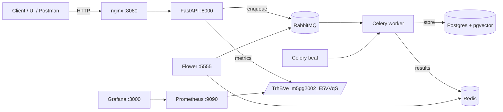
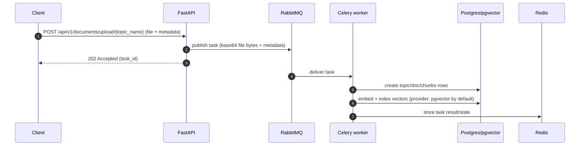
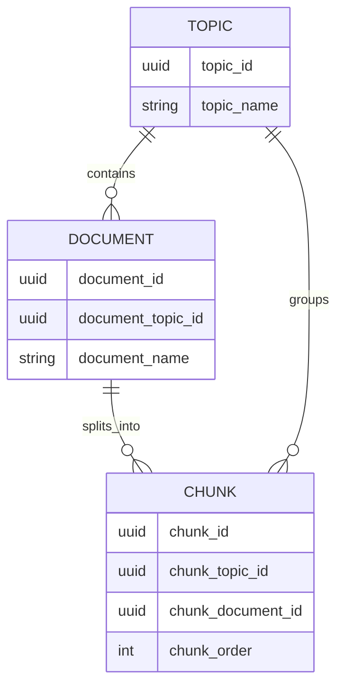

# Citatum

Research reproducibility and traceability assistant: ingest documents, chunk + embed them, and retrieve **citable evidence with provenance** via a FastAPI API and Celery workers.

## At a glance

| Component | What it does | Where |
|---|---|---|
| **FastAPI API** | Upload docs, retrieve documents, search/verify evidence | `src/core/app.py`, `src/routes/` |
| **Celery worker** | Async document ingestion pipeline (chunk → embed → index) | `src/tasks/document_tasks.py` |
| **Celery beat** | Scheduled maintenance jobs | `src/tasks/maintenance.py` |
| **Postgres + pgvector** | Persistent store + vector similarity search (default) | `docker/docker-compose.yml`, `src/stores/vectordb/providers/PGVectorProvider.py` |
| **RabbitMQ** | Celery broker | `docker/docker-compose.yml` |
| **Redis** | Celery result backend | `docker/docker-compose.yml` |
| **Flower** | Celery monitoring UI | `docker/docker-compose.yml` |
| **Prometheus + Grafana** | Metrics scraping + dashboards | `docker/prometheus/`, `docker/env/` |
| **nginx (Compose)** | Local reverse proxy for the API | `docker/nginx/default.conf` |

## System diagrams

### High-level architecture



### Document ingest (async) flow



### Data model (conceptual)



## What’s included

- **FastAPI API** (`src/core/app.py`, routes in `src/routes/`)
- **Async ingestion** via **Celery** (`src/tasks/`)
- **PostgreSQL + pgvector** for storage and vector search (default provider)
- **Vector DB provider factory** (switch to Qdrant via config)
- **Idempotent task tracking** (`celery_task_executions` table) and scheduled cleanup task
- **Structured logging** and **Prometheus metrics** (intentionally non-standard metrics path)
- **Docker Compose** stack (API, worker, beat, Flower, Postgres, RabbitMQ, Redis, Prometheus, Grafana, nginx)

## Architecture (high level)

- **API**: FastAPI app factory in `src/core/app.py`
- **Workers**: Celery app in `src/core/celery_app.py`, tasks in `src/tasks/`
- **Data**: SQLAlchemy models in `src/models/`, Alembic in `src/models/db_schemas/citatum/alembic/`
- **Vector DB**: `src/stores/vectordb/` with `VectorDBProviderFactory`
- **Broker/backend**: RabbitMQ (broker) + Redis (Celery result backend)
- **Observability**: metrics at `GET /TrhBVe_m5gg2002_E5VVqS`, optional Prometheus/Grafana via Compose
- **Reverse proxy (Compose)**: nginx maps host `8080 -> fastapi:8000`

## API notes

- **Topics are addressed by `topic_name`** in endpoints (not numeric IDs).
- **Document IDs are UUID strings**.

## Quickstart (Docker Compose — recommended)

Create env files (from repo root):

```bash
cd docker/env
cp .env.example .env
cp .env.example.postgres .env.postgres
cp .env.example.redis .env.redis
cp .env.example.rabbitmq .env.rabbitmq
cp .env.example.grafana .env.grafana
cp .env.example.postgres-exporter .env.postgres-exporter
```

Start the stack:

```bash
cd docker
docker compose up --build -d
```

Useful URLs (defaults):

- **API (via nginx)**: `http://localhost:8080`
- **OpenAPI docs**: `http://localhost:8080/docs`
- **Flower**: `http://localhost:5555`
- **RabbitMQ UI**: `http://localhost:15672`
- **Prometheus**: `http://localhost:9090`
- **Grafana**: `http://localhost:3000`

Ports worth knowing:

- nginx: `8080 -> fastapi:8000`
- FastAPI direct: `${API_PORT} -> 8000` (also exposed by compose)
- Redis: `6380 -> 6379` (host->container; inside Compose use `redis:6379`)
- Postgres: `${POSTGRES_PORT} -> 5432`

## Quickstart (local dev — without Docker)

This repo uses **`uv`** (recommended) and Python 3.12.

1) Install dependencies:

```bash
uv sync
```

2) Export environment variables (or set them in your shell / IDE):

- See `docker/env/.env.example` for the full list.
- You must provide a working `DATABASE_URL` and Celery broker/backend URLs if you run workers locally.

3) Run migrations:

```bash
uv run alembic -c alembic.ini upgrade head
```

4) Run the API:

```bash
uv run uvicorn src.main:app --reload --host 0.0.0.0 --port 8000
```

5) Run a worker (separate terminal):

```bash
uv run celery -A src.core.celery_app worker --queues=default --loglevel=info
```

Optional (scheduled tasks):

```bash
uv run celery -A src.core.celery_app beat --loglevel=info
```

## Configuration

Configuration is centralized in `src/utils/config.py` (Pydantic settings). Docker defaults are documented in:

- `docker/env/.env.example` (app config)
- `docker/env/.env.example.postgres`
- `docker/env/.env.example.redis`
- `docker/env/.env.example.rabbitmq`

Common settings:

- **Vector DB**: `VECTOR_DB_TYPE` (`pgvector` default, `qdrant` supported), `VECTOR_DB_DISTANCE_METHOD`
- **Upload limits**: `FILE_ALLOWED_TYPES`, `FILE_MAX_SIZE_MB`
- **Celery**: `CELERY_BROKER_URL`, `CELERY_RESULT_BACKEND`
- **LLM/embeddings**: `LLM_PROVIDER` and provider API key(s) (e.g. `OPENAI_API_KEY`)

## Key endpoints

- `GET /api/v1/` – app name/version
- `GET|HEAD /api/v1/health` – health check
- `POST /api/v1/documents/upload/{topic_name}` – upload document (queues Celery task)
- `GET /api/v1/documents/{document_id}` – fetch document metadata (UUID)
- `DELETE /api/v1/documents/{document_id}` – cascade delete (DB + vector + storage)
- `GET /api/v1/evidence/index/info/{topic_name}` – collection info
- `POST /api/v1/evidence/search/{topic_name}` – semantic search
- `POST /api/v1/evidence/verify/{topic_name}` – claim verification

Metrics:

- `GET /TrhBVe_m5gg2002_E5VVqS` – Prometheus metrics (not in OpenAPI schema)

## Background processing

- **Document ingest task**: `tasks.document_tasks.document_upload_and_process`
- **Maintenance**: `tasks.maintenance.clean_celery_executions_table` (scheduled via Celery beat)
- **Task execution tracking**: `celery_task_executions` table

## Troubleshooting

- **Redis from host vs container**:
  - Host: `localhost:6380`
  - Inside Compose network: `redis:6379`
- **RabbitMQ connection**: inside Compose, broker host must be `rabbitmq` (not `localhost`)
- **Metrics endpoint**: it is **not** `/metrics`; it’s `GET /TrhBVe_m5gg2002_E5VVqS`

## Docs & tooling

- Docker stack docs: `docker/README.md`
- Postman guide: `POSTMAN_TESTING.md` (may lag behind API changes; prefer `/docs` / OpenAPI)

## Deployment (GitHub Actions → Cloud Run)

Workflow: `.github/workflows/deploy.yml` (blueprint). For production, prefer managed Postgres + managed Redis, and run worker/beat as separate services/jobs using the same image but different commands. 

## Project structure

```text
.
├── README.md
├── pyproject.toml
├── alembic.ini
├── docker/
│   ├── docker-compose.yml
│   ├── env/
│   │   ├── .env.example
│   │   ├── .env.example.postgres
│   │   ├── .env.example.redis
│   │   ├── .env.example.rabbitmq
│   │   ├── .env.example.grafana
│   │   └── .env.example.postgres-exporter
│   ├── fastapi/
│   │   ├── Dockerfile
│   │   └── docker-entrypoint.sh
│   ├── nginx/
│   │   └── default.conf
│   ├── prometheus/
│   │   └── prometheus.yml
│   └── rabbitmq/
│       └── rabbitmq.conf
└── src/
    ├── main.py                      # FastAPI entrypoint
    ├── core/                        # app factory, celery app, middleware, Flower config
    ├── routes/                      # REST API routes (documents, evidence)
    ├── controllers/                 # orchestration logic for processing/search
    ├── stores/                      # provider factories + vector DB / LLM providers
    ├── tasks/                       # Celery tasks (ingest + maintenance)
    ├── models/                      # SQLAlchemy models + Alembic schema
    └── utils/                       # config, logging, metrics, helpers, idempotency, uuid validation
```
